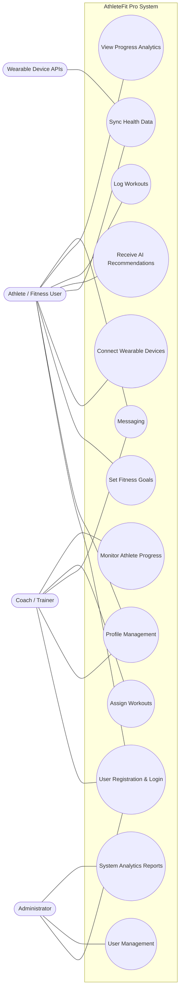
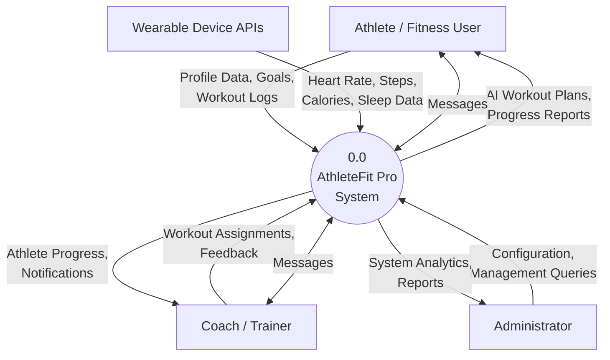
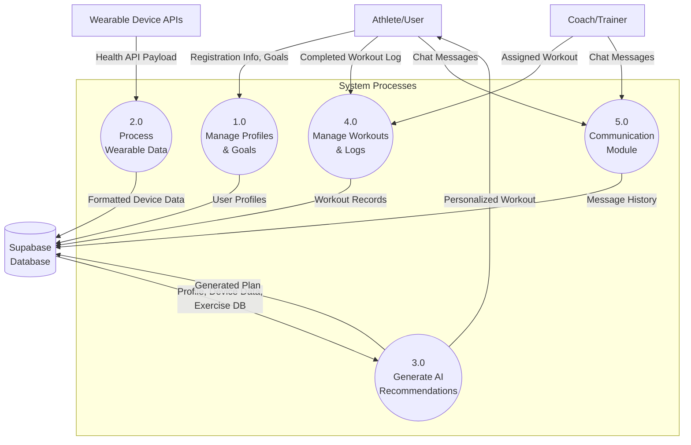
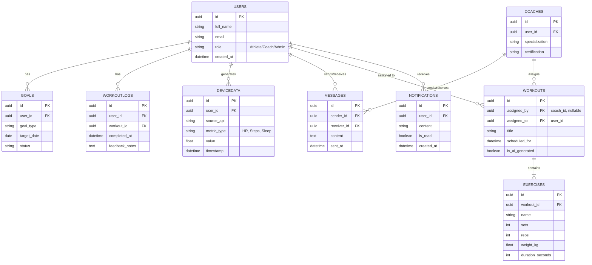
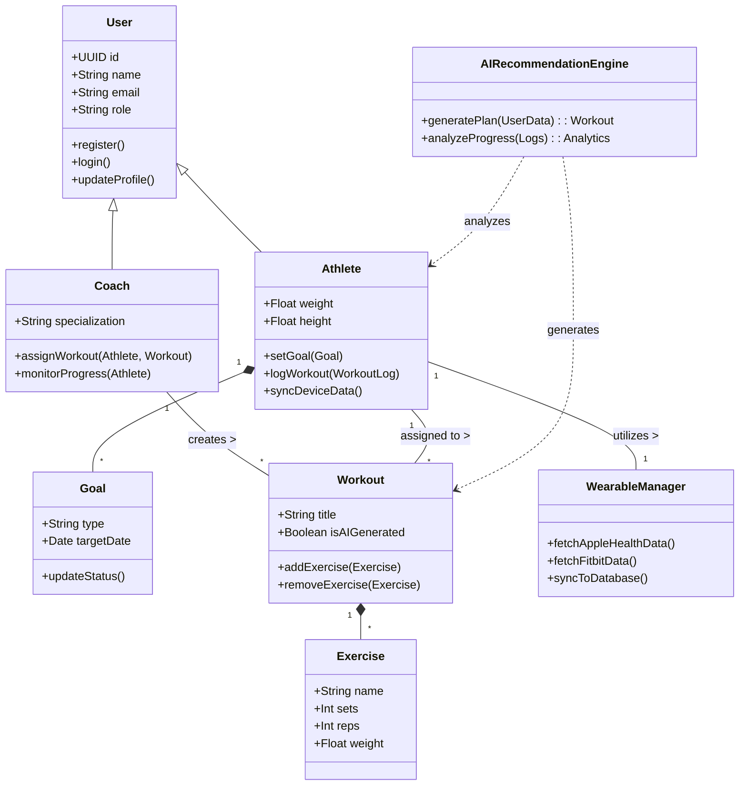
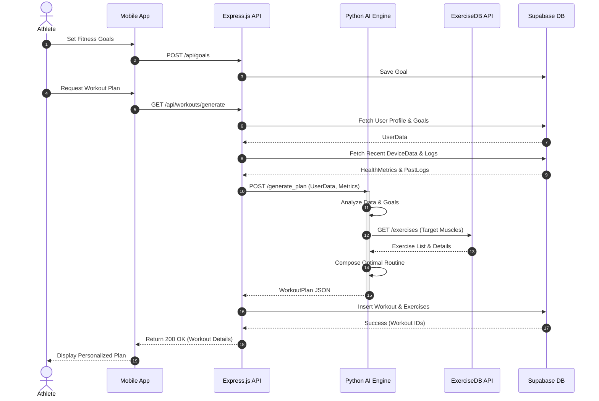
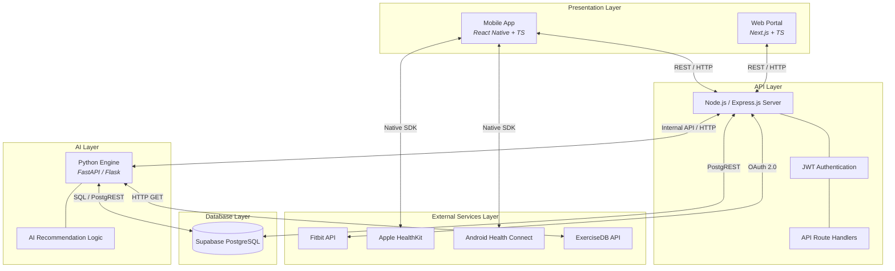
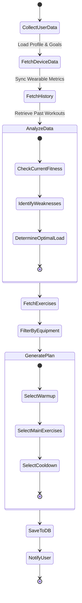
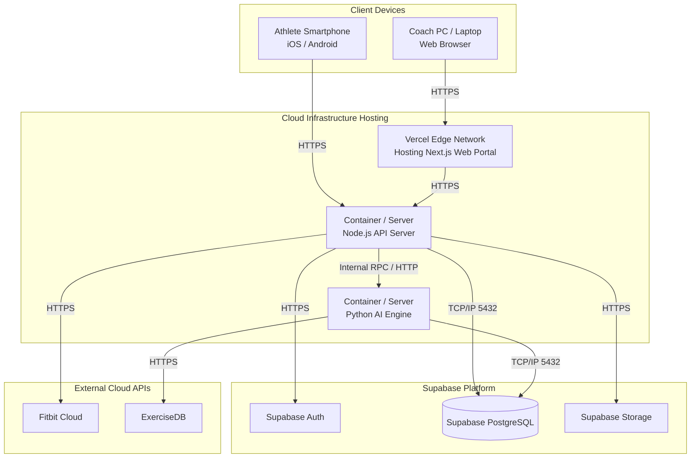

# AthleteFit Pro: AI and IoT Integration in Digital Fitness
## Software Engineering Diagrams

This document contains a complete set of professional software engineering diagrams for the AthleteFit Pro platform. The diagrams are written using Mermaid.js syntax, which is widely supported by Markdown viewers, GitHub, Notion, and academic tools. 

> **Tip for your thesis:** To get high-resolution, white-background images for your report, you can copy the code blocks below and paste them into the [Mermaid Live Editor](https://mermaid.live). From there, you can export them as high-quality PNGs or SVGs.

---

### 1. Use Case Diagram
Illustrates the interactions between the main actors and the system's core functionalities.

---

### 2. Data Flow Diagram (DFD)

#### Level 0: Context Diagram
Shows the system as a single high-level process interacting with external entities.

#### Level 1: System Processes
Breaks down the context diagram into main sub-processes.

---

### 3. Entity Relationship Diagram (ERD)
Details the database schema and relationships between core entities.

---

### 4. Class Diagram
Represents the static structure of the application's domain model.

---

### 5. Sequence Diagram: Generate Personalized Workout Plan
Shows the step-by-step object interactions required for AI workout generation.

---

### 6. System Architecture Diagram
Illustrates the layered architecture and technology stack.

---

### 7. Activity Diagram: Workout Recommendation Process
Maps the logical flow of generating a workout.

---

### 8. Deployment Diagram
Shows the physical deployment of system components across infrastructure.

